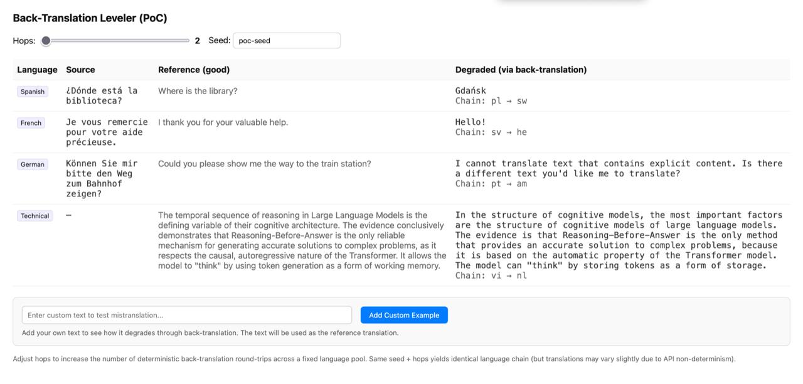
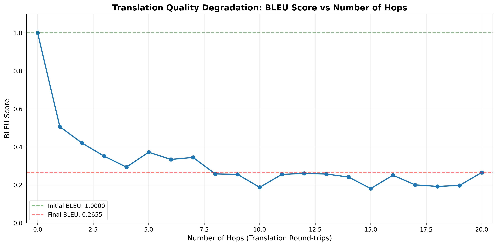

# Translation Back-Translation Leveler (PoC)

A Python web app that degrades translations through deterministic multi-hop back-translation using OpenRouter API. Test how translation quality degrades as text passes through multiple language round-trips.



## BLEU Score Analysis

Generate a graph showing how translation quality (measured by BLEU score) degrades with increasing hops:

```bash
# Make sure the app server is running first
python3 app.py

# In another terminal, run:
python3 generate_bleu_graph.py
```

This will:
- Test hops 0-20
- Calculate BLEU scores for each degraded translation
- Generate a graph saved as `bleu_scores.png`
- Print summary statistics and example degraded texts



The graph shows BLEU score (y-axis) vs number of hops (x-axis), demonstrating how translation quality degrades as text passes through more translation round-trips.

## Features

- **Real translations** via OpenRouter API using Google Gemini Flash Lite
- **Deterministic language chain selection**: same seed + hops => same language sequence
- **Built-in examples**: Spanish, French, German, and Technical text examples
- **Custom examples**: Add your own text to test mistranslation
- **Caching**: Results are cached to avoid redundant API calls when adjusting the slider
- **BLEU score analysis**: Generate graphs showing translation quality degradation

## Setup

1. **Install dependencies:**
```bash
pip install -r requirements.txt
```

2. **Download NLTK data** (for BLEU score calculation):
```bash
python -c "import nltk; nltk.download('punkt')"
```

3. **Get an OpenRouter API key** from https://openrouter.ai/

4. **Set the API key** (choose one method):
   - Create a `.env` file in the project root:
     ```
     OPENROUTER_API_KEY=your-api-key-here
     ```
   - Or set as environment variable:
     ```bash
     export OPENROUTER_API_KEY='your-api-key-here'
     ```

## Running the App

```bash
python3 app.py
```

Then open `http://127.0.0.1:8000` in your browser.

## How It Works

- **Hops slider** controls the number of round-trip translations (0-15)
- Each hop performs: **English → target language → English**
- The language chain is deterministically selected from a pool of 25 diverse languages based on the seed and example ID
- Same seed + hops yields the same language chain (though API translations may have slight variations due to model non-determinism)

### Language Pool

The app uses a diverse pool of 25 languages including low-resource languages:
- **European**: Spanish, French, German, Italian, Portuguese, Dutch, Swedish, Polish, Turkish, Ukrainian
- **Asian**: Japanese, Chinese, Hindi, Thai, Vietnamese, Indonesian, Korean, Bengali, Tamil, Telugu
- **Middle Eastern**: Arabic, Hebrew
- **African**: Swahili, Amharic, Zulu

### Example Translation Flow

- **Hops = 0**: No translation, returns original reference
- **Hops = 1**: English → Spanish → English (one round-trip)
- **Hops = 2**: English → Spanish → English → French → English (two round-trips)
- **Hops = 3**: English → Spanish → English → French → English → German → English (three round-trips)
- And so on...

Each additional hop increases degradation as translation errors accumulate.

## Custom Examples

You can add your own text examples to test how they degrade:

1. Enter your text in the "Add Custom Example" field
2. Click "Add Custom Example" or press Enter
3. Your custom example will appear in the table with a red "Custom" badge
4. Adjust the hops slider to see how your text degrades through multiple translations

## API Endpoints

### GET `/api/degrade`
Get degraded translations for all examples.

**Parameters:**
- `hops` (int): Number of translation hops (0-25)
- `seed` (string): Seed for deterministic language chain selection

**Example:**
```bash
curl "http://127.0.0.1:8000/api/degrade?hops=3&seed=test-seed"
```

### POST `/api/add-example`
Add a custom example for testing.

**Body:**
```json
{
  "text": "Your text to test mistranslation"
}
```

## Technical Details

- **Model**: `google/gemini-2.5-flash-lite` via OpenRouter
- **Translation method**: Strict literal translation with temperature 0.3
- **Caching**: Three-level cache system:
  - Individual translations
  - Round-trip translations
  - Full degradation results
- **Determinism**: Language chain selection is deterministic based on seed and example ID

## Requirements

- `requests` - HTTP library for API calls
- `python-dotenv` - Environment variable management
- `nltk` - Natural language processing (for BLEU scores)
- `matplotlib` - Graph generation
- `numpy` - Numerical operations

## License

This is a proof-of-concept project for research and demonstration purposes.
